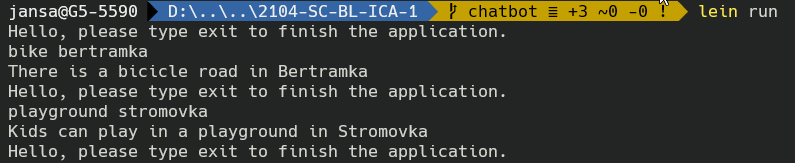
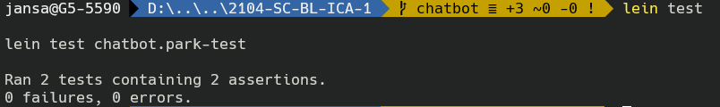

# Prague Park Guide Chatbot

This technical report presents one of the deliverables for the first part of the semestral project (ICA-1) in Symbolic Computation module. The purpose of ICA-1 is to present a basic working solution of the project proposal, which will be expanded on and finalized in the second part of the semestral project (ICA-2). The assignment was completed in a team of 4 students.

## Executive Summary

The Prague Municipality decided to promote the many natural landscapes of Prague. As they want to open the opportunity for new perspectives on tourist guides, they ask developers to join a competition. First, each team of developers is supposed to present a basic working solution of their proposal before they can get into the second round where they can complete their proposal.

Our team of hobby devs joined the competition with the aim of presenting a chatbot solution that would seamlessly allow the user to communicate about his walk in the Prague nature and make recommendations based on a set of relevant parameters. Thus you focus on the chatbot interface that will be later used for the expert system itself. The current chatbot will follow the idea of the classical ELIZA system

### Background Research

As the assignment defines the chatbot should follow the idea of the classical ELIZA system, the initial research revolved around this probably first chatbot ever created.
Additional modern chatbot implementations based on ELIZA system were examined and relevant chatbot projects hosted on GitHub were also researched. Basic programming skills with Clojure were already acquired in an earlier module, however below referenced literature and style guides were used for refreshing those skills, as none of our team works with lisp-based programming language on more frequent basis.

### Aims

The aim of this project phase is to deliver a working sample of a chatbot application to be presented to the Prague Municipality representatives. If the solution proposal gets accepted, it will be expanded on by implementing more interactive features in the second and final project phase.

### Technologies

The technologies used during the project development were the following:
- Clojure 1.10.1 - functional dialect of the Lisp programming language running on the Java platform
- Leiningen 2.9.7 - Clojure project automation tool
- Visual Studio Code - source-code editor made by Microsoft
  - Calva: Clojure & ClojureScript Interactive Programming - extension for Visual Studio Code
- GitHub - development platform

## System

Following section documents the functional requirements, implementation and testing of the resulting solution.

### Program Requirements

The following features present a minimal viable product defined by the assignment:

- The application must be started by an appropriate command
- The application needs to be at least usable from the REPL environment
- The chatbot must follow a dialogue structure that we designed, inspired by the ELIZA system, (i.e. a chatbot that parses the sentence and reacts to keywords it identifies in the text)
- The dialogue must be terminated with a suitable keyword
- The program must have at least 10 response options that use the keywords provided by the user
- The application must be able to provide basic information about Prague parks upon request. For the first task, we are supposed to provide only textual information about a park (e.g. all the textual information for Bertramka)

Example output:
```
(chatbot)
> Hello! Who are you?
Petr
> Hello Petr. How are you?
I am doing fine.
> Do you want to visit Bertramka?
Can I ride a bike there?
> Yes, you can ride a bike in Bertramka.
...
> Do you want to finish this dialogue?
Yes.
> Ok, bye!
```

### Implementation

We have started the first project phase by defining the core functionalitites, which can be developed separately by individual team members. The following core functionalities were identified:

- User interactive prompt
- Input data reader and parser
- Response dictionary
- Response handler

The development started with programming a basic prompt functionality communicating with the user and expecting an action which exits the program. Once this basic interaction was confirmed, the code for reading the provided JSON file containing the attributes of a selection of Prague parks has been implemented. Basic parsing functionality has been included in the JSON reader, striping the input data of punctuation and lower-casing all keywords.

Next step in development was creating a dictionary of the chatbot responses based on keywords provided by the user input. Multiple possible responses per keyword were implemented both for positive and negative chatbot reactions. With the dictionary in place, response handler functionality was finally developed. Overall sequence of the operations performed by the current state of the program is as follows:

- Running the command line interface expecting and reading input from user
- Reading and parsing the park data provided in the form of a JSON file
- Identifying a keyword in the input provided by the user
- Comparing the identified keyword with the data received by the JSON file and attempting to find a match
- Hooking relevant responses to the identified keyword
- Building the response and outputing it in the command line interface to the user

### Testing

The resulting application testing was performed both manually in Leiningen REPL environment and by using Leiningen `test` functionality for running test files.

The result of manual test run:




The result of running one of the test files:



## Conclusions

The assignment provided a great opportuninity to refamiliarize ourselves with functional programming paradigm and basic applicaton of symbolic computation patterns. A clear outline for developing a simple form of artificial inteligence using these concepts has been layed out. We believe we are prepared on implementing additional functionalities and expanding the abilities of our currently very primitive park recommending chatbot application in the second part of the project.

## References

- Higginbotham, Daniel. Clojure for the brave and true: learn the ultimate language and become a better programmer. No Starch Press, 2015
- Style guide - https://guide.clojure.style/
- Git best practices - https://dev.to/bholmesdev/git-github-best-practices-for-teamsopinionated-28h7
- ELIZA - https://en.wikipedia.org/wiki/ELIZA
- Prague parks - http://www.praha.eu/jnp/cz/co_delat_v_praze/parky/index.html
